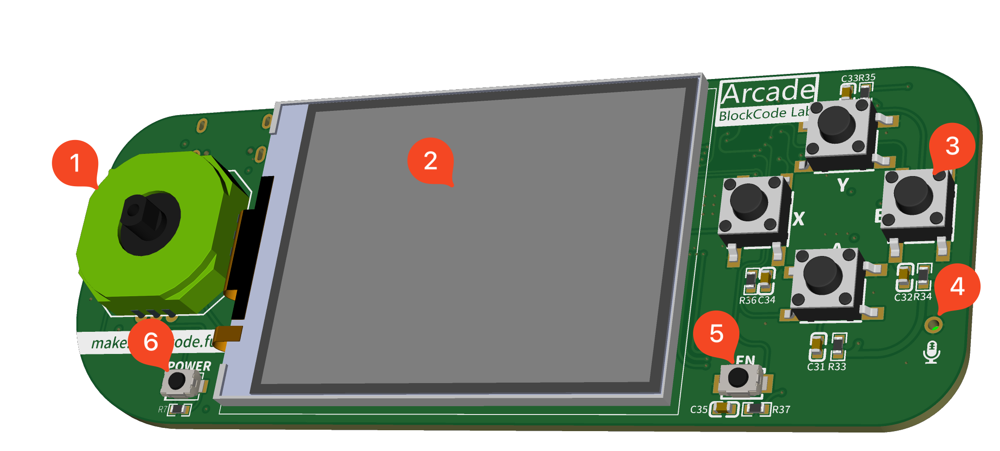
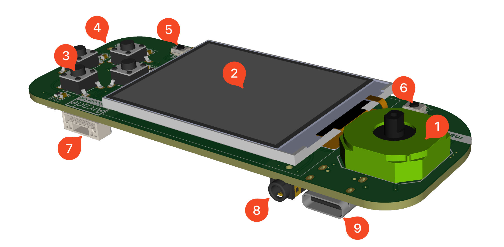

|       | 功能                           |       | 功能                       |       | 功能                           |
| ----- | ------------------------------ | ----- | -------------------------- | ----- | ------------------------------ |
| **1** | 4向超薄摇杆（**上/下/左/右**） | **2** | 2.0寸 **320×240** 高清彩屏 | **3** | 4个标准游戏按钮（**A/B/X/Y**） |
| **4** | MEMS 麦克风                    | **5** | 功能按钮（**Fn**）         | **6** | 电源按钮                       |
| **7** | 多功能扩展口                   | **8** | 2.5mm 耳机口               | **9** | Type-C USB                     |

## 产品对比

### 硬件对比

|            | Arcade                            | 小喵科技   Newbit Arcade Shield | 恩孚科技   饼干编程学习机  | MakeBlock   童芯派        |
| :--------: | --------------------------------- | ------------------------------------ | ------------------------------- | ------------------------------ |
|  **硬件**  | 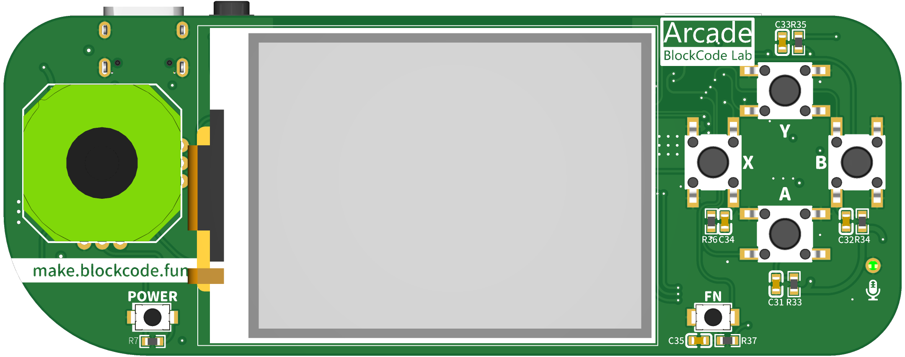             |      | 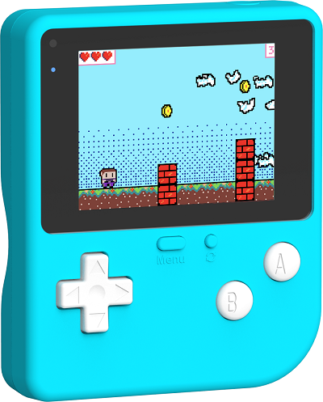 | 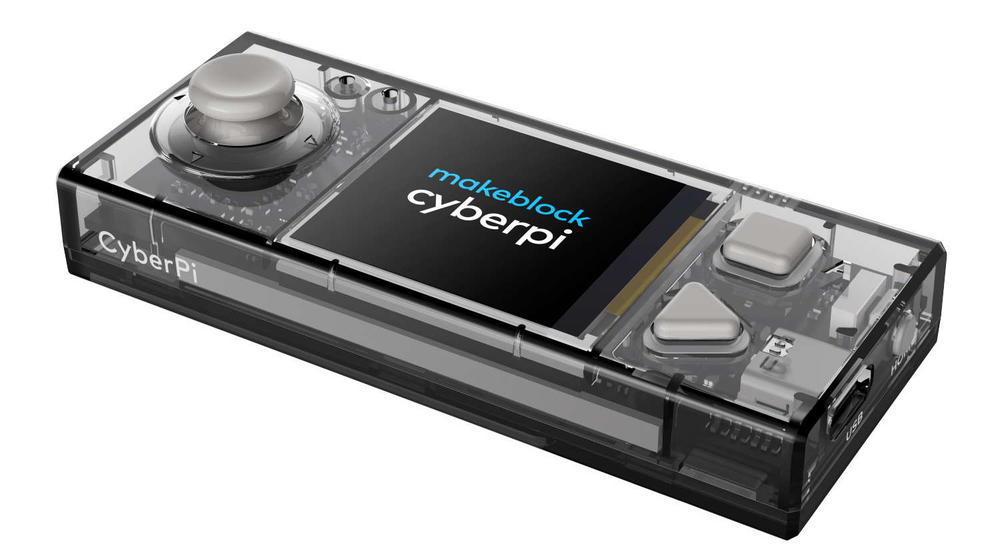     |
|    芯片    | ESP32-S3 Xtensa&copy;双核 240 MHz | micro:bit V2 主板                    | STM32 F42 100MHz                | ESP32 Xtensa&copy;双核 240 MHz |
|    屏幕    | 2.0寸 320×240 高清彩屏            | 1.77寸 160×128 彩屏                  | 2.4寸 320×240 彩屏              | 1.44寸 128×128 彩屏            |
|    网络    | 802.11b/g/n Wi-Fi                 | -                                    | -                               | Wi-Fi                          |
|    蓝牙    | Bluetooth 5                       | micro:bit V2 内置                    | -                               | Bluetooth                      |
|    电池    | 800mAh 3.7v 锂电池                | 400mAh 3.7v 锂电池                   | 560mAh 3.7v 锂电池              | 800mAh 3.7v 锂电池             |
|  方向控制  | 4向摇杆                           | 按钮 × 4                             | 按钮 × 4                        | 摇杆                           |
|  游戏按钮  | 编程按钮 × 5                      | 按钮 × 2                             | 按钮 × 2                        | 按钮 × 2                       |
|    USB     | Type-C USB                        | micro USB                            | Type-C USB                      | Type-C USB                     |
|   麦克风   | MEMS 麦克风                       | micro:bit V2 内置                    | -                               | 麦克风                         |
|    声音    | 2.5mm 耳机口                      | 蜂鸣器                               | 蜂鸣器                          | 蜂鸣器                         |
|   扩展口   | 通用 1.25mm 多功能扩展口          | Jacdac                               | Jacdac                          | 定制扩展口                     |
| 内置传感器 | -                                 | micro:bit V2 内置                    | 光敏传感器、陀螺仪、震动马达    | 传感器、陀螺仪、RGB灯× 5       |
|    价格    | ¥1xx                              | ¥329（含micro:bit）                  | ¥298                            | ¥169                           |

### 编程对比

|          | Arcade                                                                                                                                                                                                                                                      | 小喵科技   Newbit Arcade Shield                                                                                                                                                                    | 恩孚科技   饼干编程学习机                                                                                                                                                                          | MakeBlock   童芯派                                                                                                                                                                                       |
| -------- | ----------------------------------------------------------------------------------------------------------------------------------------------------------------------------------------------------------------------------------------------------------- | ------------------------------------------------------------------------------------------------------------------------------------------------------------------------------------------------------- | ------------------------------------------------------------------------------------------------------------------------------------------------------------------------------------------------------- | ------------------------------------------------------------------------------------------------------------------------------------------------------------------------------------------------------------- |
| **硬件** |                                                                                                                                                                                                                                        |                                                                                                                                                                         |                                                                                                                                                              |                                                                                                                                                                                     |
| 图形化   | 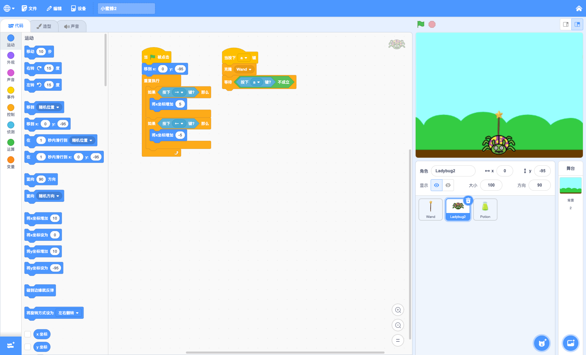                                                                                                                                                                                                                                     | 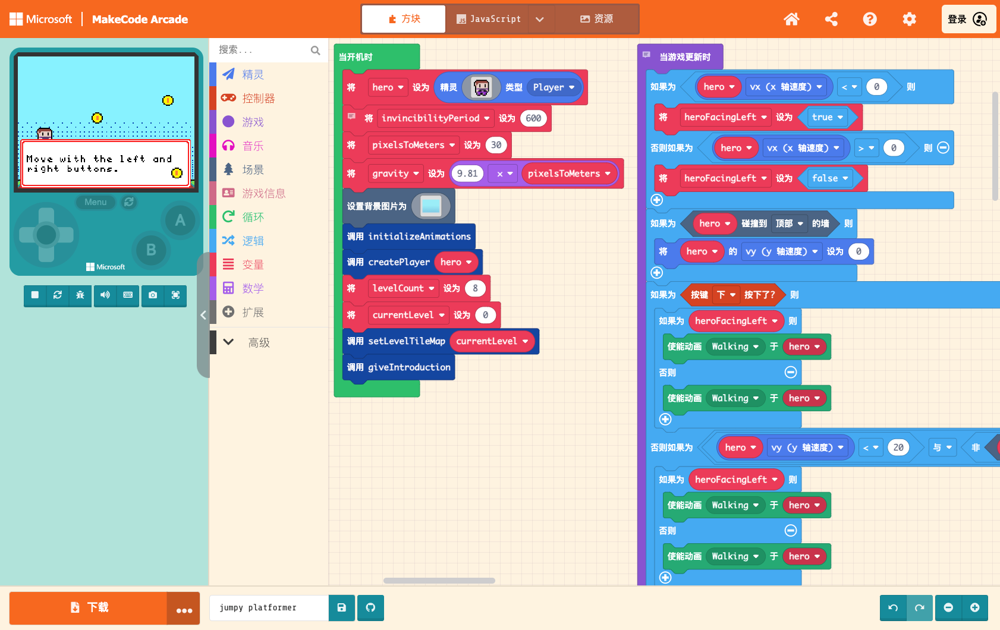                                                                                                                                                                         | 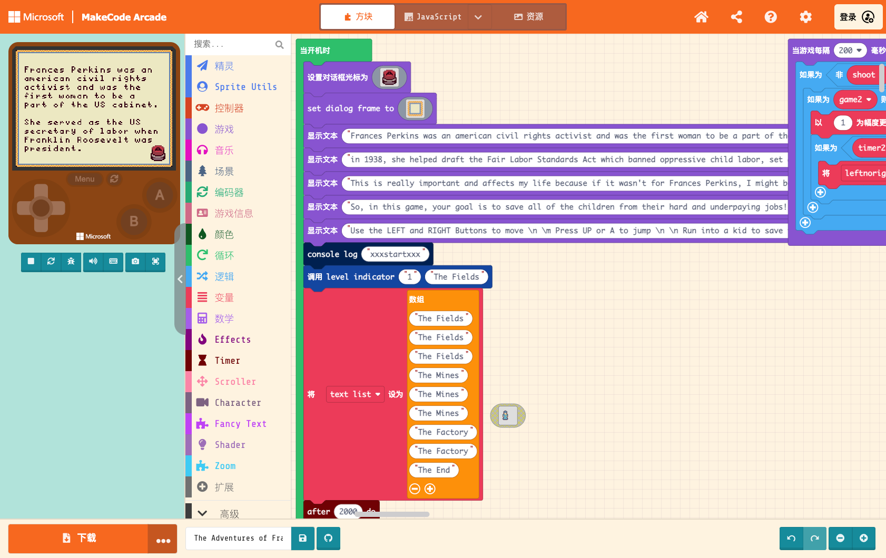                                                                                                                                                                        | 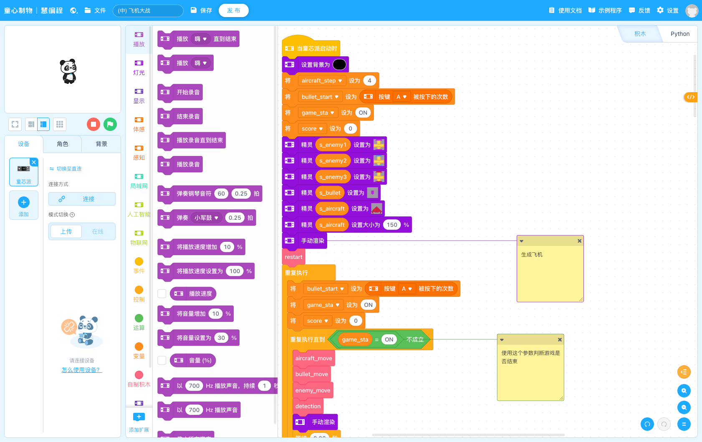                                                                                                                                                                                     |
| 仿真器   | 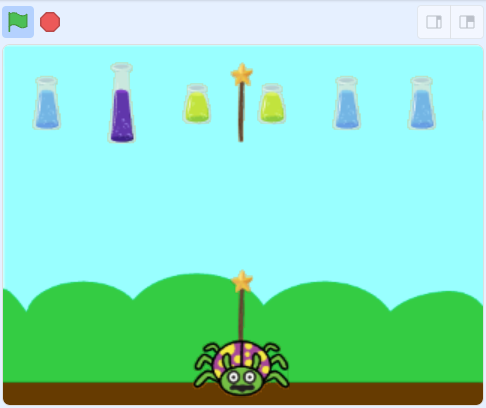                                                                                                                                                                                                                               | 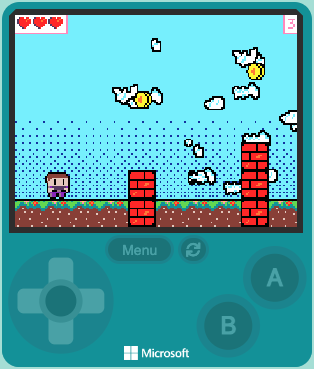                                                                                                                                                               | 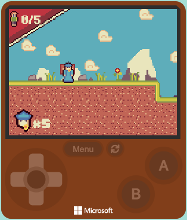                                                                                                                                                              | 无                                                                                                                                                                                                            |
| 特点     | 接近原生 Scratch 的图形编程环境，无需额外学习直接上手（已学习过Scratch编程的老师和同学），采用舞台+角色的设计模式，呈现在舞台上的即为显示在学习机屏幕上的效果，可以直接通过舞台来摆放角色位置、尺寸、外观等，控制每个角色的程序分开独立，流程逻辑更加清晰。 | MakeCode Arcade 编程工具，支持图形化编程，没有舞台和角色概念，单一程序（所有程序都在一起，不分角色）编写，精灵（角色）坐标位置只能通过程序编写，缺乏直观操作。TileMap是特色，可以可以实现卷轴地图效果。 | MakeCode Arcade 编程工具，支持图形化编程，没有舞台和角色概念，单一程序（所有程序都在一起，不分角色）编写，精灵（角色）坐标位置只能通过程序编写，缺乏直观操作。TileMap是特色，可以可以实现卷轴地图效果。 | 基于 Scratch 二开的编程工具，拥有舞台和角色，但是和设备屏幕显示无关，设备显示器只能显示简单的文字和图形。可以简单的游戏编程，与 MakeCode Arcade 的开发方式类似，但简化了只有精灵（角色），没有 TileMap 地图。 |

### 呈现效果对比

| **硬件** | Arcade                         | 小喵科技   Newbit Arcade Shield  | 恩孚科技   饼干编程学习机       | MakeBlock   童芯派         |
| -------- | ------------------------------ | ------------------------------------- | ------------------------------------ | ------------------------------- |
|          | 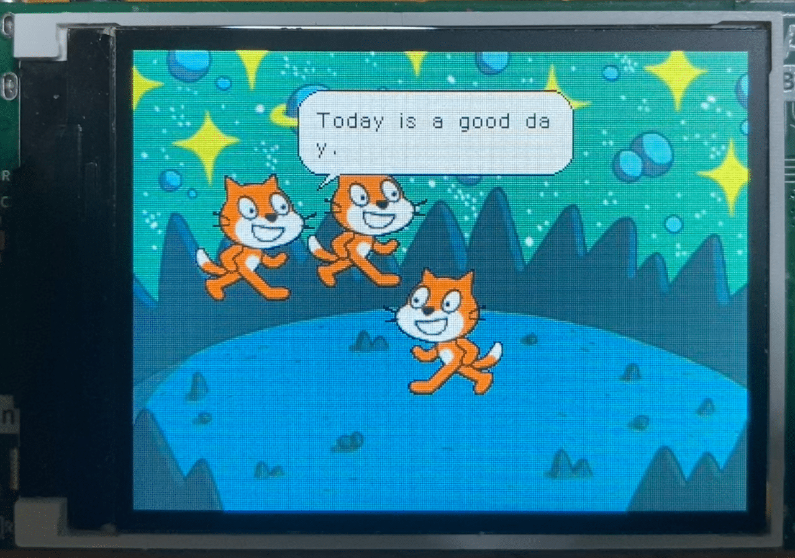 | 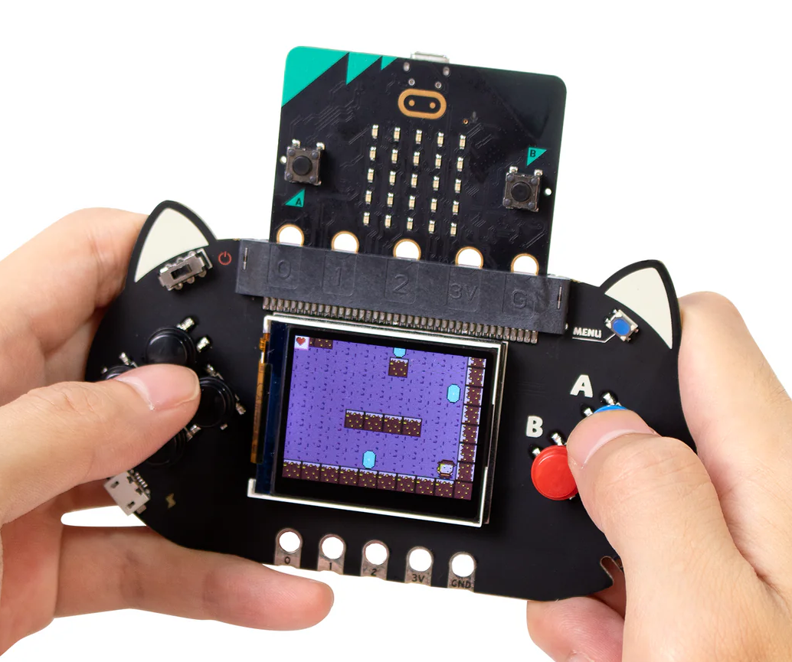 | 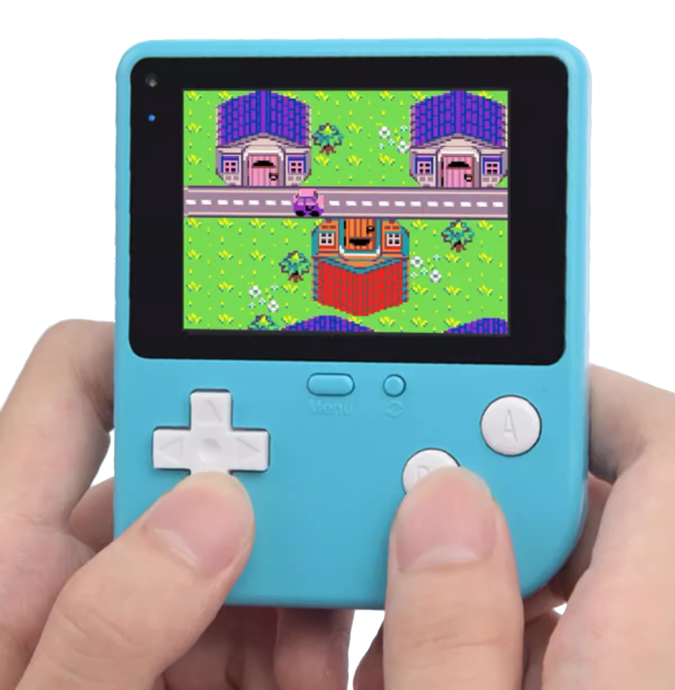 | 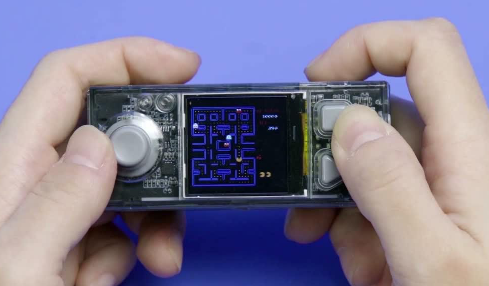 |

## 实物展示
